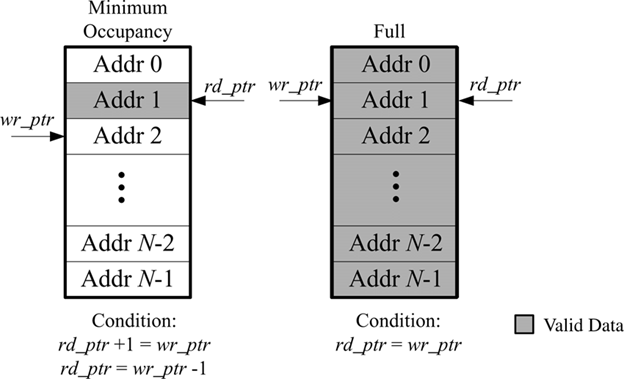
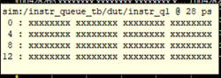
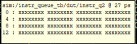
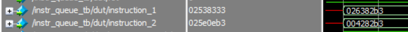
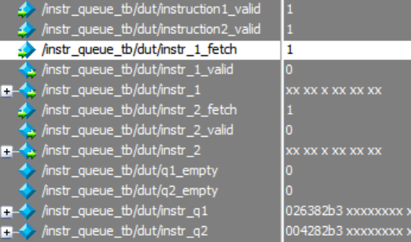
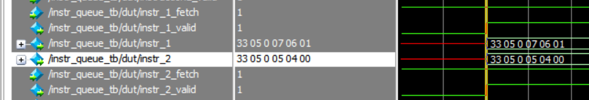
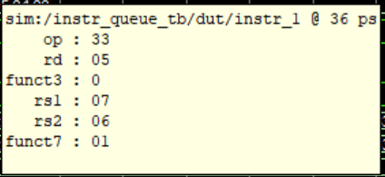
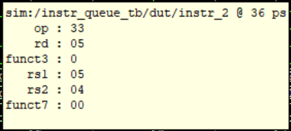
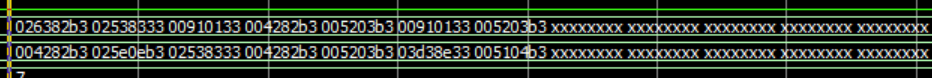
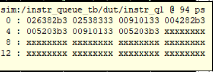

## Instruction Queue
### Design Parameters
1.  Instruction Package

    a.  Stores RISC-V instruction fields

        i.  Op

        ii. Rd

        iii. Funct3

        iv. Rs1

        v.  Rs2

        vi. Funct7

        vii. Imm

2.  Instruction Queue:

        a.  Queue Depth - 16

        b.  Utilizes 2 parallel instruction 1 and instruction 2 registers as
            the queues, think of a 2x16 table or matrix.

        c.  Read and Write pointers

        d.  Uses RISC-V instruction package to parse through instructions
            and set different fields such as op, rs1, rs2, etc.

        e.  Stores instructions on positive edge of clock

        f.  Outputs instructions on negative edge of clock

### Description

 
  

<em>Figure 2: Instruction Queue Structure</em>

Hinted at by Figure 2 the instruction queue follows a very simple
design. As I've mentioned previously however, I designed the queue to
be 2 separate arrays in parallel that represent pairs of instructions.
So essentially at every positive edge of the clock cycle, my testbench
drives a 'valid' instruction 1 and instruction 2 bit that enables the
queue to begin filling itself with instructions. These instructions
are loaded from a test file with assembly instructions decoded into
machine code.

When the dispatch unit sends a high fetch\_1 or fetch\_2 signal, the
instruction queue will respond on the next negative edge of the clock
with the RISC-V form of the instructions. Meaning the 32-bit machine
code realized into the different fields of a RISC-V instruction (op,
rs1, rs2, etc.). I chose to do this to improve clock cycle
utilization. And so naturally, on the rising edge, the write pointers
will increment if the valid signal is high, and the read pointers will
also increment if the fetch signal from the dispatch unit is high.
When the read pointers and write pointers are equal, the queue is full
and must be emptied. With my current design, when the read/write
pointers assume the max value they can take, they reset to 0 and the
queues simply \'refresh\' themselves from the head again when the
queue is full, this seems to be a functioning version of the queue \--
will have to figure if I want the queue to actually flush.

### Instruction Queue Simulation

  
  

Initially instruction queues 1 and 2, these 'columns' are empty or
undefined as the reset signal is asserted at the beginning of simulation
time for a little over 1 clock cycle.

 
  

These two instructions are first to be read.

 
  

On the next positive edge of the clock, the testbench simulates a valid
instruction1 and valid instruction2. The queue recognizes these flags
and begins filling the queue. I randomized these flags but eventually
later in simulation time, the queues became increasingly full of
instructions.

 
  

On the next fetch from the dispatch unit and negative edge of the clock,
instr\_1 and instr\_2 have values based on the fields of a RISC-V
instruction.

 
  

 
  

The immediate is not shown as this as an R-type instruction with no
immediate field. Furthermore, the queue is able to recognize two
different instructions and dispatch them at the same clock cycle.

 
  

At a later timestep, the columns have more instructions. Like so:

 
  

I hope this was enough to show the ability of the queue to load and
shift instructions and send them to the dispatch unit if requested.
