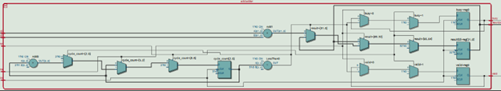

Advanced Computer Architecture: Processor Design (ECSE 4780/6700)

Abdoula Barry

# Project : SuperScalar Processor

**Section 1: Design Description**

1.1  **-- Top Level Design:**

  

<em>Figure 1: Tomasulo's machine: IBM 360/91</em>

The basic top-level hierarchy of my design follows the layout of the IBM
360/91 pretty closely with small reductions, simplifications, and even
additions along some areas. At simulation start, instructions are
sequentially loaded into an instruction queue with read and write
pointers that are incremented or stalled based on signals from a
dispatch unit. The dispatch unit also controls which signals are put on
the operation bus that drives the resources allocated among the
reservation stations. It does this based on RAW dependencies among
instructions and structural hazard checks. Furthermore, it's within the
dispatch unit that the main feature boasted by Tomasulo's algorithm is
realized: register renaming to extract concurrency among sequential
instructions. One can consider the sub system of the instruction queue
and dispatch unit to be for issuing and then decoding(renaming, among
other things) of instructions. As decoded instructions are fed into the
reservation stations, they are evaluated in terms of which renamed ID
they have and which respective reservation station unit it's sources 1
and 2 should be placed. For example, if there was instruction 'add R2,
R3, R1'. If I had an add RS available (checked by dispatch unit), it
would be placed in an add RS and sent to the adder to execute when the
adder is ready. More on this later in the design description. Once
instructions are evaluated, their results are broadcast on a common data
bus (CDB) to varying design units in the system. A register alias table,
labeled as 'FP Registers' in the figure keeps track of the renamed ID's
of different source operands in instructions. All of this to ensure that
WAW and WAR hazards are properly eliminated and register renaming fully
utilized.

1.2  **-- Design Parameters:**

*Following 32-bit RISC-V ISA*

*ADD and Multiply functionality currently*

*LOAD/STORE -- to be implemented with ROB, Load/Store queue, and Memory
unit*

*Number of Reservation Stations -- 8*

*32-Architectural Registers*

1.  Instruction Package

    a.  Stores RISC-V instruction fields

        i.  Op

        ii. Rd

        iii. Funct3

        iv. Rs1

        v.  Rs2

        vi. Funct7

        vii. Imm

2.  Instruction Queue:

        a.  Queue Depth - 16

        b.  Utilizes 2 parallel instruction 1 and instruction 2 registers as
            the queues, think of a 2x16 table or matrix.

        c.  Read and Write pointers

        d.  Uses RISC-V instruction package to parse through instructions
            and set different fields such as op, rs1, rs2, etc.

        e.  Stores instructions on positive edge of clock

        f.  Outputs instructions on negative edge of clock

3.  Dispatch Unit:

        a.  Dependency checks

            i.  RAW

            ii. Structural Hazard

        b.  Stalls if no RS available

        c.  Updates Register Alias Table

        d.  Decoded Instruction Output

            i.  [74:0] Instruction_to_RS -- Format {RS_ID<3-bits>,
                Sources 1 & 2< valid - 1 bit, tag - 3 (for 8 RS), value -
                32>}

        e.  Dispatches to RS on positive edge of clock

        f.  Reads instructions on negative edge of clock

4.  Reservation Station

        a.  2 ADD, 2 MUL, 2 LOAD, 2 STORE

        b.  Adder and multiplier instantiated within

        c.  Communicates result tags and values on common data bus (CDB)

        d.  Executes on the positive edge of clock

5.  Adder

        a.  32-bit

        b.  4-cycles

        c.  Enabled and reset by Reservation Station

6.  Multiplier

        a.  32-bit

        b.  6-cycles

        c.  Enabled and reset by Reservation Station

7.  Not yet designed

        a.  Load/Store Queue

        b.  Register File

        c.  Memory Unit
        
**Section 2: RTL Schematics**

Unfortunately, I was only able to verify the functionality of the
instruction queue, dispatch unit, and reservation stations with
adder/multiplier with separate test benches to simulate key test cases.
I can however show my RTL schematics for the design units I was not able
to verify. At the very least, they can synthesize, and I am confident in
the logic I described in my efforts to create a fully functioning
Superscalar Unit. My main regret for this project is not having the time
to do this verification and finishing the design of the Register File
which I know should follow the design of the RAT closely (right?).

 
  

<em>Figure 6: Superscalar Top Level Currently</em>

 I'm going to leave out the internals of the instruction queue and
 dispatch unit as they are both very large and complex, the dispatch
 unit especially so. The Reservation Station is also very large, but I
 will show a part of the internals where the adder and multiplier are
 located.

 
  

 
  

<em>Figure 7: Multiplier/Adder</em>

 
  

<em>Figure 8: Adder Internal</em>

The Multiplier is similar.
#
Please navigate to the module specific folders to see more about the internal design and verification. Thank you very much for looking at my work. I will continue to work on it in my spare time until it functions and will move on to supporting more
instructions and designs such as the load/store queue, branch predictor, etc. Thanks
again.

## Some (simplified) final acknowledgements of current progress:

Thank you very much for looking at my work. I will continue to work on it in my
spare time until it functions and will move on to supporting more
instructions and designs such as the load/store queue, branch predictor, etc. Thanks
again.

***Things that are done, things that aren't.***

1.  **Instruction Queue - Verified**

2.  **Dispatch Unit - Verified**

3.  **Reservation Station -- Verified**

4.  **Adder -- Verified**

5.  **Multiplier -- Verified**

6.  **Full integration -- Incomplete**

7.  **Top-level Verification -- Incomplete**

8.  **Register File -- Not designed not verified**

9.  **Load/Store Queue -- Not designed not verified**

10. **Memory Unit -- Not designed not verified**

11. **Branch Predictor -- Not designed not verified**
