## Reservation Station -- Adder -- Multiplier
### Design Parameters
1. Reservation Station

        a.  2 ADD, 2 MUL, 2 LOAD, 2 STORE

        b.  Adder and multiplier instantiated within

        c.  Communicates result tags and values on common data bus (CDB)

        d.  Executes on the positive edge of clock
2.  Adder

        a.  32-bit

        b.  4-cycles

        c.  Enabled and reset by Reservation Station
3.  Multiplier

        a.  32-bit

        b.  6-cycles

        c.  Enabled and reset by Reservation Station
## Description
        

 
    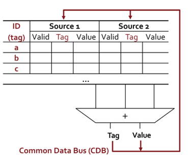

<em>Figure 5: Reservation Station Architecture</em>

Figure 5 is the structure of the RS design which is followed closely
by my hardware design in SystemVerilog. Reservation Stations for the
same function unit are grouped with each other and have unique ID's
and Sources. These sources come from the RAT table in collaboration
with the dispatch unit. The Reservation Station unit keeps track of
the free and occupied RS units and communicates that to the dispatch
unit to keep track of resource allocation. Separately, the dispatch
unit has an internal register to 'remember' what resources are
available. Anyways, the RS unit begins completely empty with just the
ID's. Upon getting instructions it of course populates and if able
will send the instruction to the next available function unit. My
design only featured one adder and one multiplier, so resources were
limited. This can be expanded to however many function units one
desires. When an instruction is completed, the tag or RSID and result
value are broadcast to all of the other reservation stations and the
RAT. Wherever the tag of the RS unit that just executed is found, the
source operand will be updated with its new value and the tag will be
removed as it is not 'waiting' or dependent on another instruction
anymore. Lastly, I designed the adder and multiplier to be
instantiated within the Reservation Station.

## Simulation Results
### Reservation Stations & Adder/Multiplier & Data Broadcast

Important design details:

    -   Dispatched instructions sent to the RS are called I1/I2 and have
        structure:

        -   \[RS\_ID\<3-bits\>, Source (1,2) \<valid - 1 bit, tag - 3 (for 8
            RS), value - 32\>\]

    -   Recall RS\_ID parameters:

        -   localparam a0 = 3\'b000; localparam a1 = 3\'b001.

        -   localparam m0 = 3\'b010; localparam m1 = 3\'b011.

        -   localparam ld0 = 3\'b100; localparam ld1 = 3\'b101.

        -   localparam st0 = 3\'b110; localparam st1 = 3\'b111.

**Case 1: Multiplier Reservation Station functionality with broadcast**

There are 2 slots for multiplier instructions in the reservation
station.

In this test case I1 and I2 are:

 
  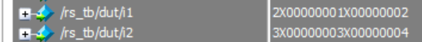

So, the dispatch unit have assigned I1 to RS m0; I2 to RS m1 --
highlighted in the red box are the RS IDs. Source operands for I1 and I2
are (1, 2) and (3, 4) respectively.

 
  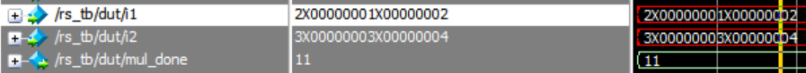

Before the instructions are placed into the reservation stations the
multiplier RS slots were marked as open, highlighted in blue.

 
  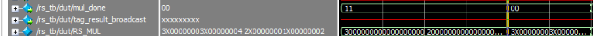

On the next clock edge, the reservation station unit fills the free
slots (blue) and tells the dispatch unit that both slots of the mul RS
are busy (red).

 
  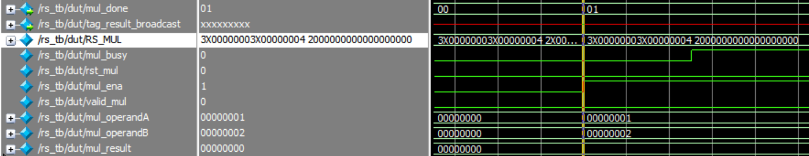

Since there's only one multiplier, the RS unit can only send one of the
mul instructions while the other waits 6 cycles for the multiplier to
finish execution. The mul operands are set, these go to the multiplier,
and execution begins.

 
  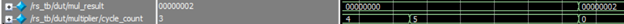

At cycle count 5, the multiplier computes the result 1 X 2, and the
broadcast occurs on the next positive edge shown below.

 
  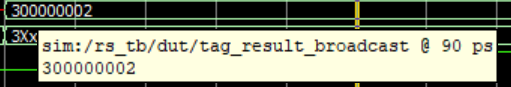

The tag is from RS m1 which you can see as the 3 there in the broadcast
and the value is 2 of course.

 
  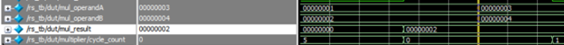

Next, the I2 operands 3 and 4 are sent to the multiplier and the cycle
resets.

**Case 2: Adder and Multiplier Reservation Station functionality with
broadcast**

The dispatch unit sends an I1 add instruction and an I2 mul instruction.

 
  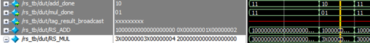

The RS unit places the instructions and both function units are enabled.

 
  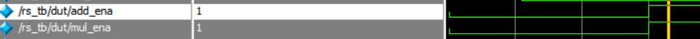

 
  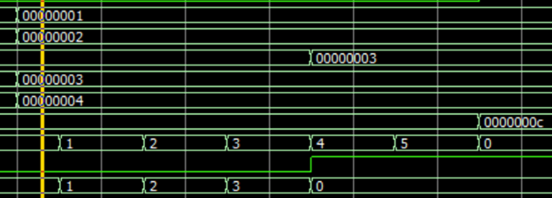

Both function units gets their operands and begin executing. After their
respective number of cycles, the adder has result 3 and the multiplier
has result 12.

I hope this was enough to show the functionality of reservation stations
and the adder/multiplier. There are of course still some bugs, but basic
functionality of the RS is there.